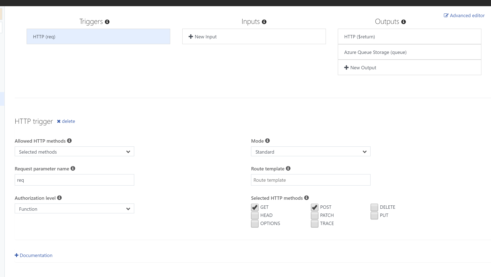
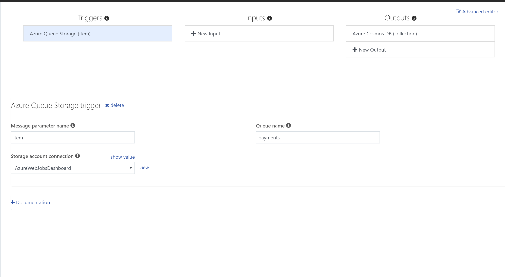

# workshop-functions

## Objetivo

Azure functions es la plataforma Serverless de Microsoft que permite crear aplicaciones sencillas que se adaptan a la demanda. Permite al programador concentrarse en la lógica de negocio delegando a la plataforma responsabilidades como escalado y disponibilidad.

El asistente va a aprender a utilizar Azure Functions a través de una serie de ejercicios.Cada ejercicio tiene como va a presentar distintos conceptos relacionados a Azure Functions y las herramientas de trabajo relacionadas.

Por medio de ejercicios prácticos se va a desarrollar una aplicación que permita generar un ticket para le ingreso a un evento luego de recibir el proceso de un pago proveniente de una fuente de terceros como puede ser Stripe o Paypal.

En la practica se van a utilizar los siguientes servicios y herramientas

- Cosmos DB
- Azure Storage
- [Azure Cli](https://docs.microsoft.com/es-es/cli/azure/install-azure-cli?view=azure-cli-latest) 
- Azure Remote Cli
- Sendgrid
- Slack
- Visual Studio Community Edition

## Requisitos

El workshop requiere que el asistente tengo como requisitos mínimos una cuenta en Azure y haya instalado Visual Studio Community Edition.

## 1) Crear Azure Function y Storage Account

El siguiente [articulo](https://docs.microsoft.com/es-es/azure/azure-functions/functions-create-first-azure-function) indica como crear una Azure function desde el portal. Como alternativa se puede usar el cli de Azure desde el portal si se ingresan los siguientes comandos.

```shell
az group create --name workshop --location eastus

```

```shell
az storage account create --name wkstoragerand123 --location eastus --resource-group workshop2 --sku Standard_LRS
```

```shell
az functionapp create --resource-group workshop2 --consumption-plan-location eastus --name function1234112018 --storage-account  wkstoragerand123 
```

> Azure requiere tener nombres únicos para los recursos. Si al crear el recurso da algún error cambien el name por otro o pueden encontrar mas ayuda en el siguiente [link](https://docs.microsoft.com/es-es/azure/azure-functions/functions-create-first-azure-function-azure-cli)

## 2) Ejercicios en el portal.

### Ejercicio 1

El asistente va a prender a crear una function y asignar bindings de entrada y de salida.

- Crear una function que retorne como respuesta `hello World` y que acepte GET y POST
- Cambiar la configuración para que solo acepte POST
- Agregar la clase NewPayment al código.
- Leer el contenido del POST y convertir el contenido a la clase NewPayment.
- Retornar el email como respuesta
- Cambiar la configuración para agregar como output una cola de mensajes. El nombre de la cola es `payments`
- Almacenar el contenido del POST en la cola de mensajes

```C#
public class NewPayment{
    public string Email {get;set;}
    public string Name {get;set;}
    public string LastName {get;set;}
    public bool Valid {get;set;}
    public string Transaction {get;set;}
}
```



## 3) Crear recurso de CosmosDB

Se requiere crear un recurso de CosmosDB para poder terminar el ejercicio 2. Para crear el recurso se pueden seguir los pasos del [tutorial](https://docs.microsoft.com/es-es/azure/cosmos-db/tutorial-develop-sql-api-dotnet) ejecutar el comando por medio del cli.

```shell
az cosmosdb create  --name cosmoswk2018 --kind GlobalDocumentDB --resource-group workshop2  --max-interval 10 --max-staleness-prefix 200 
```

### Ejercicio 2

El asistente va a aprender a configurar un trigger con cola de mensajes y una salida con CosmosDB.

Se requiere crear una nueva function que procese los mensajes que se almacenan en la cola de mensajes. La cola de mensajes se llama `payments`. Por ultimo conectar con CosmosDB para guardar el mensaje de forma permanente.

- Crear una function que utilice la cola de mensajes como trigger.
- Mostrar por el log el email y el nombre que llega por el mensaje.
- Agregar un nuevo output para almacenar el contenido del mensaje en una colección de CosmosDB
- Almacenar el mensaje en la colección de CosmosBD



### Ejercicio 3

El asistente va a aprender sobre el mecanismo de reintento utilizado por la cola de mensajes y la consecuencia cuando un mensaje falla 5 veces.

Los mensajes se reintentan 5 veces. Cuando la function falla la 5ta vez el mensaje se mueve a una cola llamada *poison*. En el ejercicio se observara como el mensaje falla y es movido a la cola `payments-poison`

- Modificar la function del ejercicio 2 para lanzar una excepción en caso de que el pago no sea valido. Si el pago es valido guardarlo en CosmosDB.
- Crear una function para procesar los mensajes inválidos y asociar el trigger a la cola payments-poison y el output a slack.

## Ejercicios en Visual Studio

### Introducción

El asistente va a aprender como utilizar Visual Studio para programar Azure Functions. Visual Studio provee una nueva característica denominada *pre-compiled functions* que es la forma recomendada de administrar un proyecto functions en C#.

- clonar el repositorio.
- Abrir la solución src/inicial
- Abrir el archivo Functions.cs
- Que diferencias encontramos con el portal?
- Que significa los atributos que decoran cada argumento de los métodos `RecievePayment, OnNewPayment, OnError`
- Abrir el archivo de configuración local.settings.json y setear las variables definidas.

Nombre | Descripción
-------|-------------
AzureWebJobsDashboard| Storage connection string para almacenar metadata sobre azure functions requeridas para el portal.
AzureWebJobsStorage| Storage connection string por default para Queue, Table y Blob storage
CosmosCollection| Nombre de la collecion de CosmosDB. Para el ejemplo usamos `payments`
CosmosDB | Nombre de la base de datos de CosmosDB. Para le ejemplo usamos `workshop`
CosmosConnection| Connection string de CosmosDB

- Test local
- Deploy usando Visual Studio


### Ejercicio 4

Se requiere crear una function para generar un ticket por cada registro almacenado en CosmosDB. La function debe utilizar el atributo correspondiente a CosmosDBTrigger para ser invocada cada vez que se ingresa un mensaje a la base de datos.

El atributo para configurar un trigger de CosmosDB tiene los siguientes [parámetros](https://docs.microsoft.com/es-es/azure/azure-functions/functions-bindings-cosmosdb#trigger---c-example).

```C#
[CosmosDBTrigger(databaseName: "%CosmosDB%", collectionName: "%CosmosCollection%", ConnectionStringSetting = "CosmosConnection", CreateLeaseCollectionIfNotExists = true)]
```

Parametro | Descripcion
------------ | -------------
databaseName | nombre de la base de datos a conectar.
collectionName | nombre de la coleccion a conectar.
ConnectionStringSetting | setting que contiene la connection string.
CreateLeaseCollectionIfNotExists | Flag que indica si hay que crear una collection lease para administrar el acceso concurrente entre instancias.

> Functions permite utilizar string con formato `%SETTINGNAME%` para acceder a valores almacenados en la configuración. Por ej en el ejemplo anterior utilizamos `%CosmosDB%` que en la configuración hace referencia al valor `workshop`

- Agregar un nuevo método `GenerateTicket` que se ejecuta cuando se guarda un registro en CosmosDB.
- Generar un nuevo archivo que representa un ticket y guardarlo en Azure Blob Storage.
- Crear un fork del repositorio en Github.
- Configurar Azure para hacer deploy usando Github
- Deploy usando push
